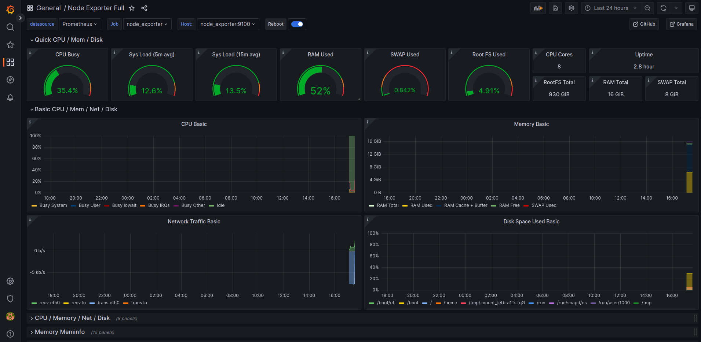

# Grafana metrics

Cette branche présente une solution de monitoring de l'utilisation de la machine par le projet. Elle utilise prometheus enn conbinaison a grafana ce qui permet un affichage plus peronnsalisé.



# Mise en place
Pour commencer, on crée un dossier qui contiendra le docker compose de la nouvelle stack de monitoring. Ce [docker compose](./dockerComposer_grafana/docker-compose.yaml) contient les services prometheus qui va venir scrapper les données à interval régulier ainsi que grafana, qui va venir mettre en forme les données pour l'affichage (même si prometheus peut aussi faire de l'affichage, mais grafana est plus agréable pour les yeux selon nous).

Promethus seul dans son conteneur ne peux pas fonctionner pleinement, il lui faut un fichier de configuration, on place donc un fichier [prometheus.yml](./dockerComposer_grafana/prometheus/prometheus.yml) dans un nouveau répertoire (dans le dossier du docker compose) dans lequel on va venir taper la configuration choisie (ici, celle à defaut de la doc prometheus).

On peut alors lancer la stack avec la commande :

```shell
sudo docker-compose up -d
```

Il reste maintenant à configurer la liason entre prometheus et grafana. Tout d'abord, il faut se connecter dans le [localhost://6060](localhost://6060). Les login et mot de passes à défaut de grafana sont admin/amdin (le mot de passe sera changé à la première connexion). On arrive alors sur l'interface d'acceuil de grafana, cliquez alors sur "Add your first datasource", selectionnez prometheus. Il sera alors demandé de renseigner l'url de prometheus. Comme nous avons un docker compose, nous pouvons passer par l'ip du network, pour la trouver, il faut taper la commande :

```bash
docker inspect -f '{{range.NetworkSettings.Networks}}{{.IPAddress}}{{end}}' prometheus
```

⚠️ ne pas oublier de mettre le port 9090 à la suite de l'ip et le http:// avant

Cliquez sur "save and test" pour sauvegarder la source. On peut alors retourner sur l'aceuill grafana et créer le dashboard. Pour cela, il faut cliquer sur la flèche à coté du logo en haut à gauche puis dashboard>import. On a choisi d'utiliser un dashboard venant de la connumauté car prometheus utilise un node_exporter qui est très compatible avec un [dashborad](https://grafana.com/grafana/dashboards/1860-node-exporter-full/) provenant de grafana labs. On entre donc l'id 1860, on séléctionne la source crée précédmeent puis on valide. On arrive alors sur un dashboard donnant plusieurs informations sur l'utilisation de la machine extraites par prometheus.
