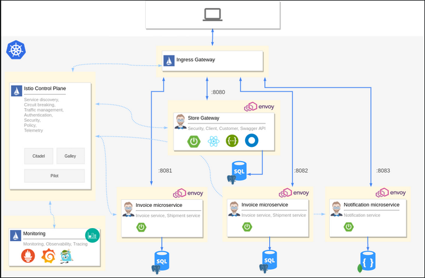
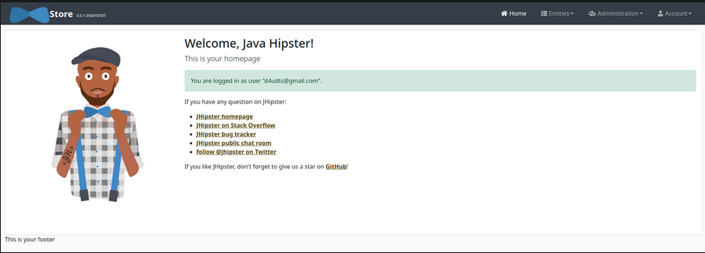
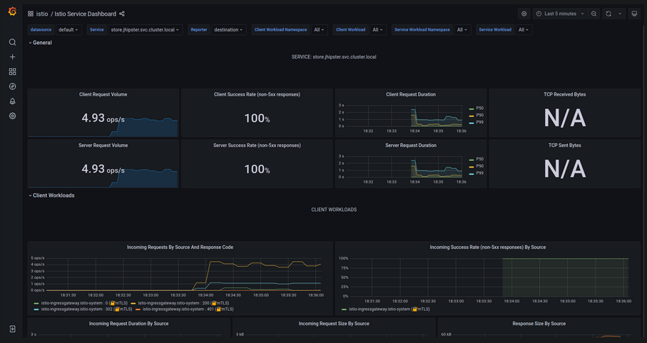
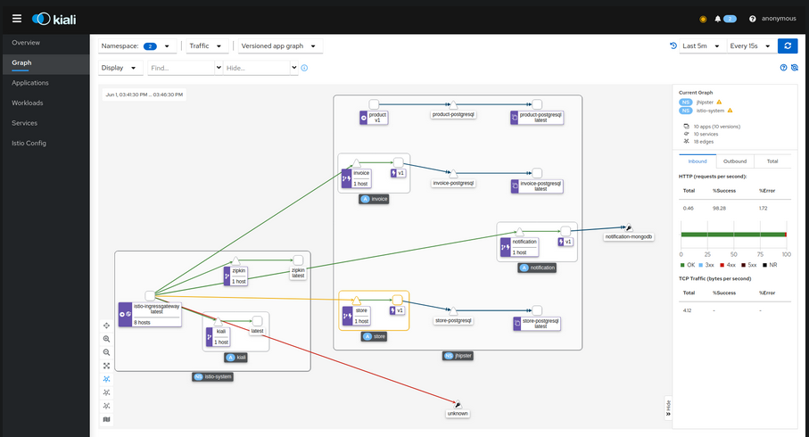
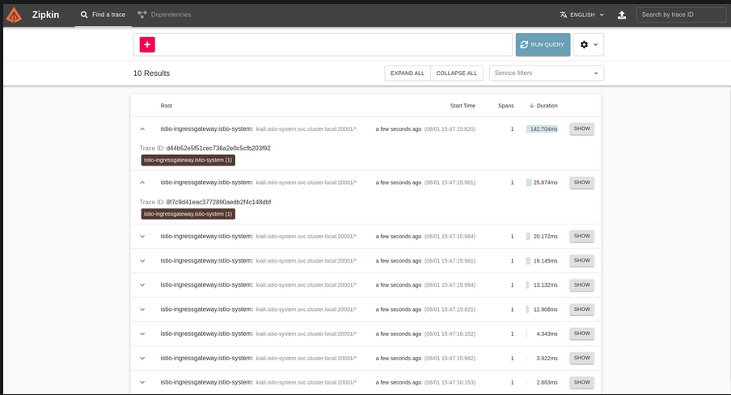

# Sommaire Cloud Native Application and Microservices

- [I- Introduction](#i-introduction)
    - [I.1- Présentation de l'application "Kaia Vente"](#i1-présentation-de-l-application-pet-clinic)
    - [I.2- Objectifs du tutoriel](#i2---objectifs-du-tutoriel)
- [II- Prérequis](#ii-prérequis)
    - [II.1- Configuration de l'environnement de développement](#ii1-configuration-de-l-environnement-de-développement)
    - [II.2- Outils et technologies nécessaires](#ii2-outils-et-technologies-nécessaires)
- [III- Créer une pile de microservices Java à l'aide de JHipster](#iii-créer-une-pile-de-microservices-java-à-l-aide-de-jhipster)
    - [III.1- Installer JHipster](#iii1-installer-jhipster)
    - [III.2- Générer la pile de microservices avec JHipster](#iii2-générer-la-pile-de-microservices-avec-jhipster)
    - [III.3- Exploration de la structure de la pile de microservices générée](#iii3-exploration-de-la-structure-de-la-pile-de-microservices-générée)
- [IV- Créer un cluster GKE et installer Istio](#iv-créer-un-cluster-gke-et-installer-istio)
    - [IV.1- Créer un cluster GKE](#iv1-créer-un-cluster-gke)
    - [IV.2- Installer Istio sur le cluster](#iv2-installer-istio-sur-le-cluster)
    - [IV.3- Installer des outils d'observabilité](#iv3-installer-des-outils-d-observabilité)
- [V- Déployer la pile de microservices sur GKE](#v-déployer-la-pile-de-microservices-sur-gke)
    - [V.1- Créer des manifestes Kubernetes](#v1-créer-des-manifestes-kubernetes)
    - [V.2- Déployer sur GKE](#v2-déployer-sur-gke)
- [VI- Surveillance et observabilité](#vi-surveillance-et-observabilité)
    - [VI.1-  Accéder à Grafana pour visualiser les métriques](#vi1--accéder-à-grafana-pour-visualiser-les-métriques)
    - [VI.2- Accéder à Kiali pour visualiser la topologie du service mesh](#vi2-accéder-à-kiali-pour-visualiser-la-topologie-du-service-mesh)
    - [VI.3- Accéder à Zipkin pour visualiser les traces des requêtes](#vi3-accéder-à-zipkin-pour-visualiser-les-traces-des-requêtes)
- [VII- Nettoyer le cluster GCP](#vii-nettoyer-le-cluster-gcp)
- [VIII- Conclusion](#viii-conclusion)
    - [VIII.1- Résumé des étapes](#viii1-résumé-des-étapes)
    - [VIII.2- Points forts et points faibles](#viii2-points-forts-et-points-faibles)
    - [VIII.3- Points d'amélioration](#viii3-points-d-amélioration)
- [IX- Références](#ix-références)

## I- Introduction 

### I.1- Présentation de l'application "Kaia Vente"

L'application "Kaia Vente" est une application web de vente en ligne de produits électroniques développée avec Java et Spring Boot et basée sur une architecture microservices. C'est une solution complète pour les entreprises souhaitant se lancer dans le commerce électronique, avec des fonctionnalités clés telles :

- La gestion des utilisateurs :  inscription, connexion et gestion de profil
- La gestion du catalogue de produits : recherche, filtres et détails des produits
- Le panier d'achat : ajout ou suppression d'articles, modification des quantités
- La commande avec paiement : passage de commande, paiement et suivi de l'état de la commande.


### I.2- Objectifs du tutoriel

L'objectif de ce tutoriel est de vous guider dans la création et le déploiement d'une application de vente en ligne de produits électroniques basée sur une architecture de microservices cloud-native avec l'utilisation de Kubernetes et Istio. En suivant les étapes de ce tutoriel, vous allez acquérir les connaissances et les compétences nécessaires pour :

- Concevoir une architecture de microservices en Java pour l'application Kaia Vente, avec la gestion de l'authentification, du catalogue de produits, du panier d'achat et des commandes.
- Containeriser les microservices avec Docker pour faciliter le déploiement et la gestion.
- Déployer la pile de microservices sur un cluster Kubernetes à l'aide des manifestes Kubernetes fournis dans le projet.
- Utiliser Istio pour la gestion de la circulation réseau entre les microservices et pour la surveillance et l'observabilité.
- Configurer des outils d'observabilité tels que Grafana, Kiali et Zipkin pour surveiller les performances de l'application.

À la fin de ce tutoriel, vous aurez acquis une compréhension pratique de la création d'une application cloud-native de microservices Java et de son déploiement sur Kubernetes avec Istio, en vous concentrant sur les fonctionnalités clés de l'application Kaia Vente.

## II- Prérequis

### II.1- Configuration de l'environnement de développement

Pour pouvoir suivre ce tutoriel, il est nécessaire de configurer votre environnement de développement. Vous aurez besoin des éléments suivants :

- Un système d'exploitation compatible avec Docker et Kubernetes
- Kubernetes installé sur votre machine. ([kubectl](https://kubernetes.io/docs/tasks/tools/) est une bonne option pour les utilisateurs de Windows et de Mac)
- Un éditeur de code tel que Visual Studio Code, IntelliJ IDEA, Eclipse ou tout autre éditeur de code que vous êtes à l'aise d'utiliser.

Si vous n'avez pas encore installé ces éléments sur votre machine, veuillez suivre les instructions appropriées pour votre système d'exploitation avant de continuer avec les sections suivantes de ce tutoriel.

### II.2- Outils et technologies nécessaires

Pour suivre ce tutoriel, vous aurez besoin de plusieurs outils et technologies :

- Java 11
- Maven 3.x
- JHipster 7.x
- Docker ([Docker](https://www.docker.com/get-started/))
- Un compte Google Cloud Platform (GCP) pour créer un cluster Kubernetes sur Google Kubernetes Engine (GKE)
- Node.js ([Node.js](https://nodejs.org/en/download/))

## III- Générer la pile de microservices avec JHipster

### III.1- Installer JHipster

JHipster est un générateur d'application Web qui permet de créer rapidement des applications modernes et performantes. Dans ce tutoriel, nous allons utiliser JHipster pour générer une application "Kaia Vente" avec des microservices en Java. Pour installer JHipster, suivez les étapes ci-dessous :

1. Assurez-vous d'avoir une version de Node.js installée sur votre système. Vous pouvez télécharger la dernière version stable à partir du site officiel : https://nodejs.org/en/download/

2. Ouvrez une invite de commande et tapez la commande suivante pour installer JHipster via npm :
    
    ```npm install -g generator-jhipster```

3. Vérifiez que JHipster est installé en exécutant la commande suivante :
    
    ```jhipster --version```

Maintenant que JHipster est installé, nous pouvons générer notre application "Kaia Vente" avec des microservices en Java.

### III.2- Générer la pile de microservices avec JHipster

#### III.2.1- Présentaion et description de l'architecture de l'application "Kaia Vente"

Avant de générer notre application avec JHipster, il est important de comprendre l'architecture de l'application "Kaia Vente". Comme mentionné précédemment, notre application sera basée sur une architecture de microservices.

Plus précisément, nous allons utiliser une architecture en couches avec des microservices qui communiquent entre eux via des API REST. L'architecture de l'application "Kaia Vente" est décrite dans le diagramme ci-dessous :



Cette architecture permet de découpler les différents composants de l'application et de les développer et les déployer indépendamment les uns des autres, ce qui permet une évolutivité horizontale en fonction des besoins. L'architecture en couches permet également de séparer les responsabilités de chaque couche, ce qui facilite la maintenance et l'extension de l'application.

Dans notre application "Kaia Vente", nous aurons les microservices suivants :

- **store** : qui sert de point d'entrée pour l'application. Il est responsable de la gestion de la sécurité et de la redirection des requêtes vers les microservices appropriés.
- **product** : qui gère les produits vendus dans notre magasin en ligne. Il prend en charge les opérations CRUD (Create, Read, Update, Delete) pour les produits, les catégories de produits, les commandes de produits et les articles de commande.
- **invoice** : qui gère le panier d'achat de l'utilisateur. Il prend en charge les opérations CRUD pour les articles du panier d'achat et les commandes.
- **notification** : qui gère les notifications pour les clients. Il prend en charge l'envoi de notifications par e-mail, SMS et colis.

Maintenant que nous avons une compréhension de l'architecture de notre application, nous pouvons passer à la création du fichier app.jdl.

#### III.2.2- Création du fichier app.jdl

Le fichier app.jdl est un fichier de définition de l'application qui décrit les entités de l'application et leurs relations. Il est utilisé par JHipster pour générer les microservices et les entités de l'application.

Pour créer le fichier app.jdl, suivez les étapes ci-dessous :

1. Créez un nouveau répertoire sur votre machine et nommez-le "kaia-vente".

2. Ouvrez le répertoire "kaia-vente" dans votre éditeur de code préféré.

3. Créez un nouveau fichier appelé "app.jdl" dans le répertoire "kaia-vente".

4. Ouvrez le fichier "app.jdl" et collez le code suivant : [app.jdl](docs/app.jdl.md)

#### III.2.3- Générer l'application avec JHipster à partir du fichier app.jdl

Maintenant que nous avons créé le fichier app.jdl, nous pouvons générer notre application avec JHipster. Pour cela, après avoir ouvert le répertoire "kaia-vente" dans votre éditeur de code préféré, ouvrez une invite de commande et exécutez la commande suivante pour générer l'application "Kaia Vente" :
    ```jhipster import-jdl app.jdl```

### III.3- Exploration de la structure de la pile de microservices générée

Après avoir généré notre application à partir du fichier app.jdl, nous allons explorer la structure de la pile de microservices générée.

En ouvrant le répertoire "kaia-vente" dans votre éditeur de code préféré, vous devriez voir les répertoires suivants :

- **invoice** : ce microservice gère la facturation des achats effectués sur la plateforme.
- **notification** : ce microservice gère l'envoi de notifications aux utilisateurs.
- **product** : ce microservice gère les produits vendus sur la plateforme.
- **store** : ce microservice gère le magasin en ligne et les achats effectués par les utilisateurs.

En examinant la structure de la pile de microservices, vous remarquerez que chaque microservice est indépendant et peut être déployé séparément. De plus, chaque microservice communique avec les autres microservices via des API REST. Cette architecture de microservices permet une grande flexibilité et une évolutivité facile de l'application.

Vous pouvez maintenant explorer chaque microservice individuellement pour mieux comprendre son fonctionnement et sa contribution à l'application globale.

## IV- Creer un cluster GKE et installer Istio

Pour déployer notre pile de microservices sur Google Kubernetes Engine (GKE), nous avons besoin de créer un cluster GKE et d'installer Istio sur ce dernier. Dans cette section, nous allons vous montrer comment créer un cluster GKE et installer Istio à l'aide de l'outil de ligne de commande Google Cloud SDK.

### IV.1- Créer un cluster GKE

La première étape consiste à créer un cluster GKE. Pour cela, vous devez disposer d'un compte Google Cloud et avoir installé le Google Cloud SDK.

Pour créer un cluster GKE, suivez les étapes ci-dessous :

1. Ouvrez une invite de commande et connectez-vous à votre compte Google Cloud avec la commande suivante :
    
    ```gcloud auth login```
Cette commande va ouvrir une fenêtre dans votre navigateur web pour que vous puissiez vous connecter à votre compte Google Cloud.

2. Créez un nouveau projet Google Cloud avec la commande suivante :
    
    ```gcloud projects create kaia-vente```
Cette commande va créer un nouveau projet avec le nom "kaia-vente" dans votre compte Google Cloud.

3. Configurez le projet Google Cloud avec la commande suivante :
    
    ```gcloud config set project kaia-vente```
Cette commande va configurer le projet "kaia-vente" comme étant votre projet par défaut.

4. Activez l'API Kubernetes Engine avec la commande suivante :
    
    ```gcloud services enable container.googleapis.com```
Cette commande va activer l'API Kubernetes Engine pour votre projet. Cette API est nécessaire pour créer un cluster GKE. Vous devez necessairement activer la facturation pour votre projet Google Cloud pour pouvoir activer cette API.

5. Fournir la région et la zone où vous souhaitez créer votre cluster GKE avec la commande suivante :
    
    ```gcloud config set compute/region europe-west1``` et    
    ```gcloud config set compute/zone europe-west1-b```
La première commande va définir la région de votre cluster GKE à "europe-west1" et la deuxième commande va définir la zone de votre cluster GKE à "europe-west1-b". Vous pouvez choisir une région et une zone différente si vous le souhaitez.

6. Créez un nouveau cluster GKE avec la commande suivante :
    
    ```gcloud container clusters create kaia-vente --num-nodes=4 --machine-type=n1-standard-2```
Cette commande va créer un nouveau cluster GKE avec le nom "kaia-vente" avec 4 noeuds et des machines de type n1-standard-2. Vous pouvez ajuster le nombre de noeuds et le type de machines en fonction de vos besoins.

7. Une fois que le cluster est créé, vous pouvez le vérifier en utilisant la commande suivante :
    
    ```gcloud container clusters list```
Cette commande va afficher la liste de tous les clusters GKE dans votre projet Google Cloud, y compris le cluster que vous venez de créer.

8. Une fois le cluster créé, il doit être défini automatiquement comme contexte Kubernetes actuel. Vous pouvez le vérifier en exécutant la commande suivante :
    
    ```kubectl config current-context```
Cette commande va afficher le nom du contexte Kubernetes actuel. Si le nom du contexte est "gke_kaia-vente_europe-west1-b_kaia-vente", cela signifie que le cluster GKE que vous venez de créer est défini comme contexte Kubernetes actuel. 
Si cela n'est pas le cas, vous pouvez définir le cluster GKE que vous venez de créer comme contexte Kubernetes actuel avec la commande suivante :
        ```gcloud container clusters get-credentials kaia-vente```

### IV.2- Installer Istio sur le cluster

Istio est une solution de service mesh open source qui permet de connecter, sécuriser et contrôler les services d'une application cloud native. En utilisant Istio, les développeurs peuvent se concentrer sur la logique métier de leur application, tandis qu'Istio gère les aspects liés à la communication et à la sécurité des services.

Les avantages d'Istio pour une architecture cloud microservices sont nombreux. Istio offre une visibilité complète sur la communication entre les services, ce qui permet de diagnostiquer rapidement les problèmes et de surveiller les performances de l'application. Istio permet également de renforcer la sécurité des communications entre les services en utilisant des fonctionnalités telles que le chiffrement des données, la gestion des certificats et la gestion des identités. Enfin, Istio facilite la mise en place de politiques de trafic, qui permettent de contrôler finement le trafic réseau entre les services.

Avant de commencer l'installation d'Istio, il est recommandé de définir la variable d'environnement ISTIO_VERSION avec la version souhaitée d'Istio. Pour cet exemple, nous utiliserons la version 1.13.4 en lançant la commande suivante :
    ```export ISTIO_VERSION=1.13.4```

Ensuite, nous devons télécharger la dernière version d'Istio à partir du site officiel. Pour cela, nous allons utiliser la commande curl avec l'option -L pour suivre les redirections et exécuter le script d'installation.
    ```curl -L https://istio.io/downloadIstio | ISTIO_VERSION=1.13.4 sh -```

Cela va extraire les fichiers Istio dans un répertoire nommé istio-$ISTIO_VERSION. Nous pouvons nous y rendre en exécutant la commande suivante :
    ```cd istio-$ISTIO_VERSION```

Maintenant que nous avons accès aux binaires Istio, nous devons ajouter le répertoire bin à notre chemin d'exécution pour pouvoir utiliser la commande istioctl. Nous pouvons ajouter le chemin en utilisant la commande export :
    ```export PATH=$PWD/bin:$PATH```

Maintenant que nous avons Istio installé et les outils de la CLI configurés, nous pouvons l'installer sur notre cluster GKE. Istio fournit plusieurs profils prêts à l'emploi, tels que **demo**, **production** ou **development**. Pour cet exemple, nous allons utiliser le profil demo en lançant la commande suivante :
    ```istioctl install --set profile=demo -y```
Cela va installer Istio sur notre cluster et configurer toutes les ressources nécessaires, comme les CRD (Custom Resource Definitions) et les services Istio. L'option -y permet de répondre automatiquement à toutes les questions pour éviter les interruptions lors de l'installation.

Une fois l'installation terminée, nous devons récupérer l'adresse IP externe de la passerelle d'entrée Istio. Pour cela, nous allons utiliser la commande kubectl :
    ```kubectl get svc istio-ingressgateway -n istio-system```

### IV.3- Installer les outils d'observabilité

Pour observer et monitorer les données de télémétrie fournies par Istio, il est recommandé d'installer Grafana, Prometheus, Kiali et Zipkin sur notre cluster. Ces outils sont fournis en tant que modules complémentaires dans Istio et sont préconfigurés pour fonctionner avec les données de télémétrie fournies par Istio.

Nous allons maintenant installer ces outils en exécutant les commandes suivantes depuis le dossier où Istio a été installé :
```
cd istio-$ISTIO_VERSION
kubectl apply -f samples/addons/grafana.yaml
kubectl apply -f samples/addons/prometheus.yaml
kubectl apply -f samples/addons/kiali.yaml
kubectl apply -f samples/addons/extras/zipkin.yaml

```

Une fois l'installation terminée, vous pouvez vérifier que les différents composants sont en cours d'exécution dans l'espace de noms istio-system en exécutant la commande suivante :
    ```kubectl get pods -n istio-system```
Cette commande vous permettra de voir les différents composants Istio ainsi que Grafana, Prometheus, Kiali et Zipkin en cours d'exécution.

## V- Déployer la pile de microservices sur GKE

Maintenant que nous avons configuré Istio et installé les outils d'observabilité sur notre cluster GKE, il est temps de déployer notre pile de microservices Kaia-service. Pour cela, nous allons utiliser des manifestes Kubernetes qui décrivent les différents composants de notre application. Dans cette partie, nous allons créer ces manifestes et les appliquer à notre cluster.

### V.1- Créer les manifestes Kubernetes

Le déploiement de JHipster sur Kubernetes est une tâche relativement simple, grâce à la génération automatique des fichiers YAML Kubernetes à partir d'un fichier JDL (JHipster Domain Language). Pour cela, vous pouvez créer un nouveau fichier JDL avec les spécifications de déploiement souhaitées, comme le type de déploiement, les dossiers d'application, le référentiel Docker, le type de découverte de service, et d'autres options. 

Par exemple, vous pouvez créer un fichier JDL nommé "deployment.jdl" contenant les spécifications suivantes :
```
// will be created under 'kubernetes' folder
deployment {
  deploymentType kubernetes
  appsFolders [store, invoice, notification, product]
  dockerRepositoryName "<your-docker-repository-name>"
  serviceDiscoveryType no
  istio true
  kubernetesServiceType Ingress
  kubernetesNamespace jhipster
  ingressDomain "<istio-ingress-gateway-external-ip>.nip.io"
  ingressType gke
}
```

Dans ce fichier JDL, nous avons activé Istio et défini le domaine d'entrée sur l'adresse IP externe de la passerelle d'entrée Istio que nous avons notée précédemment. Pour mapper un DNS pour l'adresse IP, nous pouvons utiliser un service DNS générique comme nip.io. Une fois que le fichier JDL est prêt, vous pouvez exécuter à partir du dossier racine la commande suivante :
    ```jhipster jdl deployment.jdl```

Cela créera un nouveau dossier, "kubernetes", avec tous les manifestes Kubernetes requis tels que les déploiements, les services, les services virtuels Istio, les passerelles, etc., pour toutes les applications, bases de données et surveillance.

Chacun des services disposera également d'un service virtuel Istio et d'une règle de destination pour définir les politiques de trafic.

### V.2- Déployer sur GKE

Avant de déployer notre application sur GKE, nous devons créer et envoyer les images Docker au registre. Pour cela, nous allons utiliser les commandes Jib fournies par JHipster. Naviguez vers chacun des dossiers de microservices et exécutez les commandes suivantes :
```
cd store && ./gradlew bootJar -Pprod jib -Djib.to.image=kaia4service/store
cd invoice && ./gradlew bootJar -Pprod jib -Djib.to.image=kaia4service/invoice
cd notification && ./gradlew bootJar -Pprod jib -Djib.to.image=kaia4service/notification
cd product && ./gradlew bootJar -Pprod jib -Djib.to.image=kaia4service/product

```

Une fois les images Docker créées et poussées vers le registre, nous pouvons déployer notre application sur GKE à l'aide du script fourni par JHipster. Accédez au dossier kubernetes créé par JHipster et exécutez la commande suivante :
    ```
    cd kubernetes
    ./kubectl-apply.sh -f   
    ```

Une fois les déploiements effectués, il faut attendre que les pods soient en statut RUNNING . Les liens utiles seront imprimés sur le terminal ; notez-les. Vous pouvez maintenant accéder à l'application à http://store.jhipster.34.79.34.217.nip.io l'URI donné et vous connecter avec les informations d'identification par défaut.



## VI- Surveillance et observabilité

Lorsque vous travaillez avec des microservices, il est important d'avoir une visibilité sur leur performance et leur santé. Dans cette section, nous allons configurer les outils de surveillance et d'observabilité fournis par Istio pour nos microservices.

### VI.1- Accéder à Grafana pour visualiser les métriques

Grafana est un outil de visualisation et de surveillance qui permet d'afficher des graphiques et des tableaux de bord pour les métriques collectées par Prometheus. Nous allons utiliser Grafana pour visualiser les métriques de nos microservices.

Pour accéder à Grafana, ouvrez votre navigateur et accédez à l'URL suivante : 
    

Après avoir déployé votre application à l'aide de la commande ./kubectl-apply.sh -f, les liens utiles pour accéder à l'application et à Grafana seront imprimés sur le terminal. Vous pouvez accéder à Grafana en cliquant sur le lien correspondant, qui ressemble à ceci :
    ```http://grafana.istio-system.<IP-ADDRESS>.nip.io```.
Remplacez **IP-ADDRESS** par l'adresse IP de votre cluster Kubernetes. Si vous utilisez un cluster Kubernetes local, vous pouvez utiliser localhost à la place de l'adresse IP.

Une fois que vous avez accédé à l'interface de Grafana, il est deja configuré avec un tableau de bord Istio par défaut (Istio Service Dashboad). Vous pouvez voir les métriques de votre application dans ce tableau de bord. Vous pouvez également créer vos propres tableaux de bord en utilisant les métriques collectées par Prometheus. Pour cela, vous pouvez utiliser l'interface de requête de Prometheus pour créer des requêtes personnalisées et les ajouter à un tableau de bord.



### VI.2- Accéder à Kiali pour visualiser la topologie du service mesh

Kiali est un outil de visualisation open source pour Istio qui permet de visualiser la topologie de votre service mesh et les relations entre les différents services. Il fournit des informations détaillées sur la circulation du trafic dans votre service mesh, y compris les statistiques de trafic, les temps de réponse, les erreurs et les latences.

Pour accéder à l'interface web de Kiali, vous pouvez cliquer sur le lien imprimé sur le terminal après avoir déployé votre application à l'aide de la commande ./kubectl-apply.sh -f. Le lien ressemble à ceci:
    ```http://kiali.istio-system.<IP-ADDRESS>.nip.io```.
Remplacez **IP-ADDRESS** par l'adresse IP de votre cluster Kubernetes. Si vous utilisez un cluster Kubernetes local, vous pouvez utiliser localhost à la place de l'adresse IP.

Lorsque vous accédez à l'interface web de Kiali, vous pouvez voir la topologie de votre service mesh et les relations entre les différents services. Vous pouvez également afficher des graphiques pour les statistiques de trafic, les temps de réponse, les erreurs et les latences, ainsi que pour les requêtes envoyées et reçues par chaque service.

L'avantage de cette méthode est que vous pouvez facilement visualiser la topologie de votre service mesh et les relations entre les différents services. Vous pouvez utiliser cette information pour diagnostiquer les problèmes de performance et de fiabilité, ainsi que pour améliorer la qualité de votre application. En utilisant Kiali avec Istio, vous pouvez surveiller et visualiser les interactions entre les microservices de votre application, ce qui peut vous aider à améliorer la performance et la fiabilité de votre application.



### VI.3- Accéder à Zipkin pour visualiser les traces des requêtes

Istio utilise Zipkin pour la collecte et l'analyse des traces des requêtes entre les microservices. Zipkin est un outil open source qui permet de tracer les requêtes HTTP à travers les différents services d'une application.

Pour accéder à l'interface web de Zipkin, vous pouvez cliquer sur le lien imprimé sur le terminal après avoir déployé votre application à l'aide de la commande ./kubectl-apply.sh -f. Le lien ressemble à ceci:
    ```http://zipkin.istio-system.<IP-ADDRESS>.nip.io```
Remplacez **IP-ADDRESS** par l'adresse IP de votre cluster Kubernetes. Si vous utilisez un cluster Kubernetes local, vous pouvez utiliser localhost à la place de l'adresse IP.

Lorsque vous accédez à l'interface web de Zipkin, vous pouvez voir les traces des requêtes entre les différents services de votre application. Vous pouvez également effectuer des recherches pour trouver des traces spécifiques et filtrer les résultats en fonction de différents critères.

L'avantage de cette méthode est que vous pouvez facilement visualiser les traces des requêtes à travers les différents services de votre application. Vous pouvez utiliser cette information pour diagnostiquer les problèmes de performance et de fiabilité, ainsi que pour améliorer la qualité de votre application. En utilisant Zipkin avec Istio, vous pouvez collecter et analyser les données de trace pour améliorer les performances et la fiabilité de vos microservices.



## VII- Nettoyer le cluster GCP

Après avoir terminé le tutoriel et testé l'application, il est important de nettoyer votre cluster GCP pour éviter des frais supplémentaires inutiles. Voici les étapes à suivre pour supprimer votre cluster :

1. Exécutez la commande suivante pour supprimer tous les déploiements, services, ingress, gateway, virtualservices, et tous les autres objets Kubernetes créés par Istio et JHipster : 
    ```./kubectl-delete.sh -f```

2. Supprimez votre cluster à l'aide de la commande suivante :
    ```gcloud container clusters delete <CLUSTER-NAME>```
Remplacez <CLUSTER-NAME> par le nom de votre cluster.

## VIII- Conclusion

### VIII.1- Résumé des étapes

Ce tutoriel vous a montré comment déployer une application Java basée sur microservices en utilisant JHipster et Istio sur un cluster Google Cloud Platform (GCP). Voici un résumé des principales étapes que vous avez suivies :

1. Installer les prérequis : Docker, Java, JHipster, Istio et Google Cloud SDK

2. Générer une application de base avec JHipster

3. Configurer Istio pour déployer l'application sur un cluster GCP

4. Déployer l'application sur le cluster GCP en utilisant Kubernetes et Istio

5. Tester l'application

6. Surveiller et observer l'application en utilisant Grafana, Zipkin et Kiali

7. Nettoyer le cluster GCP en supprimant tous les objets Kubernetes et en supprimant le cluster

### VIII.2- Points forts et points faibles

L'utilisation de JHipster et Istio pour développer et déployer des applications basées sur microservices présente plusieurs avantages, notamment :

- Une génération de code rapide et efficace avec JHipster
- Une gestion du trafic flexible et évolutive avec Istio
- Une observabilité et une surveillance avancées avec Grafana, Zipkin et Kiali
- Une facilité de déploiement sur un cluster Kubernetes avec Istio

Cependant, l'utilisation de JHipster et Istio peut également présenter certains inconvénients, tels que :

- Une complexité accrue du code généré par JHipster
- Une complexité accrue de la configuration de l'application avec Istio
- Des coûts supplémentaires pour l'utilisation d'un cluster GCP

### VIII.3- Points d'amélioration

Il existe plusieurs points d'amélioration pour ce tutoriel, notamment :

- Ajouter plus de détails sur les configurations et les paramètres avancés pour Istio et Kubernetes
- Explorer d'autres outils d'observabilité et de surveillance, tels que Prometheus et Jaeger
- Expliquer comment intégrer l'application avec d'autres services cloud, tels que Firebase ou AWS
- etc.

En suivant ces suggestions et en explorant d'autres outils, vous pouvez améliorer votre application et votre expérience de développement.

## IX- Références

- [JHipster](https://www.jhipster.tech/)
- [Istio](https://istio.io/)
- [Kubernetes](https://kubernetes.io/)
- [Google Cloud Platform](https://cloud.google.com/)
- [Docker](https://www.docker.com/)
- [Grafana](https://grafana.com/)
- [Kiali](https://www.kiali.io/)
- [Zipkin](https://zipkin.io/)


## X- Auteurs

- [ANGORA KOUAME](https://github.com/akai-code/)
- [KONE OUMAR](https://github.com/koneWoumar/)
- [TAPE WALI](https://github.com/twzbja/)


