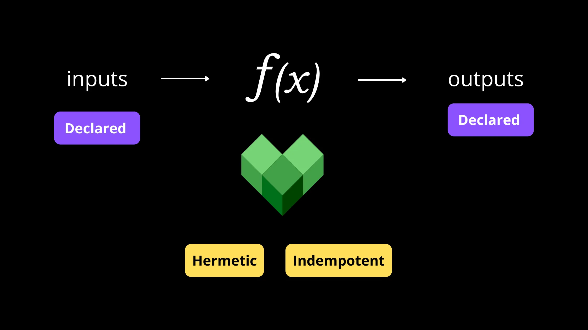
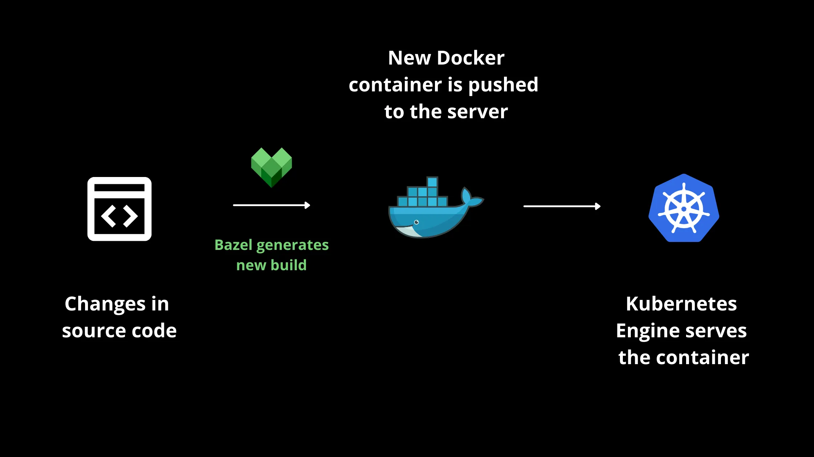

# Bazel

# Principe
Bazel est un système de construction et de gestion de dépendances open-source développé par Google. Il est conçu pour être rapide, évolutif et extensible, et permet de construire et de tester des projets logiciels à grande échelle. Bazel prend en charge plusieurs langages de programmation tels que Java, C++, Python et d'autres, ainsi que plusieurs plateformes, y compris Linux, macOS et Windows.

Cependant, contrairement à d'autres outils qui sont spécifiques à un cadre de travail, Bazel est adapté aux projets ayant des dépendances multilingues.

Bazel possède plusieurs avantages : 
Tout d'abord, il permet la reproductibilité grâce à sa fonctionnalité d'entrée sortie. En effet, via Bazel, les fichiers de sortie dépendent strictement de l'entrée. Celà rend aussi le débogage plus facile.



Il permet également l'utilisation de Docker et Kubernetes afin de démarrer un environnement de test qui ressemble à un environnement de production à travers les conteneurs.



Enfin, Bazel accélère le temps de build. Il utilise un système de cache intelligent qui stocke les résultats de chaque étape de la construction et de test, ce qui permet d'accélérer considérablement les itérations de développement. Il permet également de générer des builds parallèles sur une seule machine ainsi que sur plusieurs machines à distance.

# Utilisation 
Pour installer Bazel, on a utilisé le tuto disponible sur le site officiel de Bazel. Pour cela, on a utilisé brew en raison de notre OS. Pour tester Bazel, nous avons suivi un tutoriel très complet et informatif trouvé sur le web décrivant la mise en place de Bazel pour un projet Node.js. 

Dans ce tutoriel, on met en place un projet Node.js puis nous installons certains dépendances liées à Bazel. On ajoute ensuite une ligne dans le fichier BUILD.bazel et nous configurons Babel pour notre projet en créant un fichier es5.babelrc avec nos options de constructions dedant. Ensuite on utilise nos instructions pour déclarer les entrées et les sorties de notre construction à l'intérieur du BUILD.bazel. Enfin on a juste à exécuter la commande build de npm pour générer un dossier bazel-out et un repertoire dist. Le code JavaScript transpilé est à l'intérieur dist/bin/app.es5.js.

## ❤️ Support  
| Liens utiles | 
| --------  |
| [Installation de Bazel](https://bazel.build/about/intro)    | 
| [Tutoriel de la mise en place d'un projet](https://semaphoreci.com/blog/bazel-build-tutorial-examples)    | 

## 🛠️ Install Dependencies   
On vient tout d'abord cloné le repository :
```bash
git clone https://github.com/Payll/DevOps.git
```
On va ensuite dans le dossier qi contient notre projet :
```bash
cd bazel/bazel_js_monorepo
```
On installe les dépendances :
```bash
npm install
```
Enfin on vient build le projet et générer les dossiers :
```bash
npm run build
```  

## Conclusion
Bazel s'inscrit dans le cadre d'une stratégie de continuous integration en automatisant le processus de compilation, de test et de déploiement des applications, ce qui permet de réduire les temps d'arrêt et d'accélérer la livraison des nouvelles fonctionnalités.


