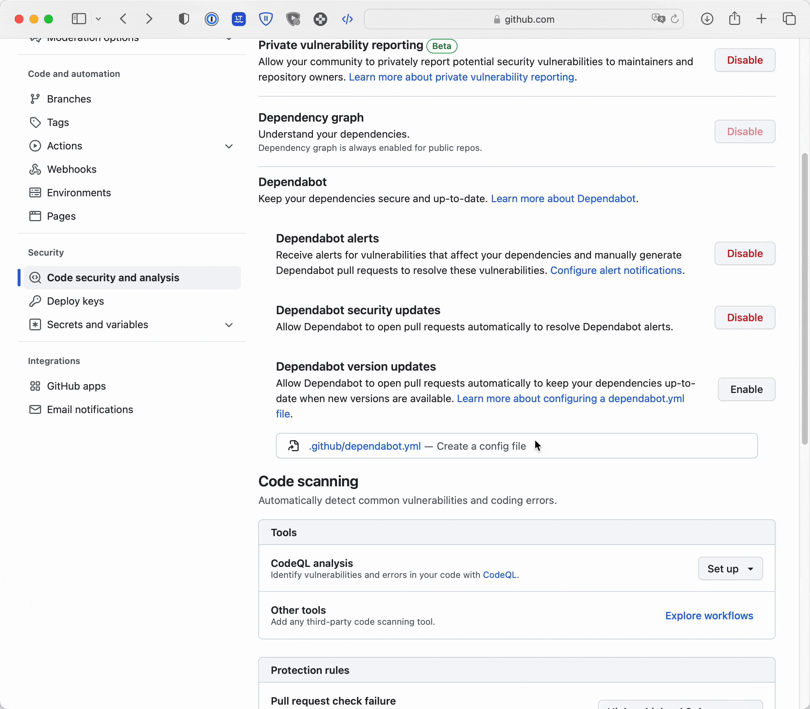
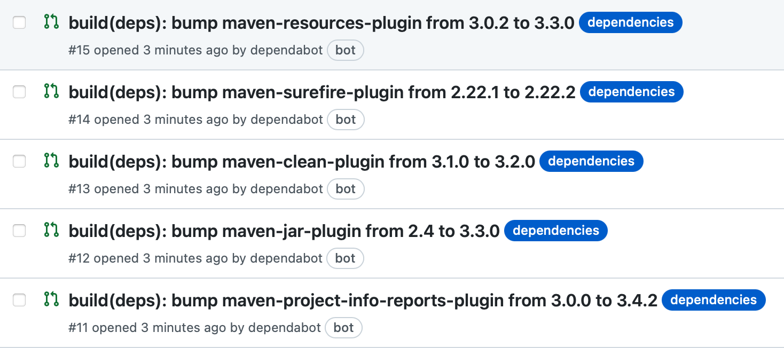

    

<h1 align="center">Dependabot</h1>

---

## 🤨 What is Dependabot?

Dependabot is a bot that "Keep your dependencies secure and up-to-date". It is a service that is provided by GitHub and is free for open-source projects.
It has 3 main features that can be enabled independently:
- **Dependabot alerts**: Receive alerts for vulnerabilities that affect your dependencies and manually generate Dependabot pull requests to resolve these vulnerabilities.
- **Dependabot security updates**: Allow Dependabot to open pull requests automatically to resolve Dependabot alerts.
- **Dependabot version updates**: Allow Dependabot to open pull requests automatically to keep your dependencies up-to-date when new versions are available.

The Dependabot settings can be found in the `Code security and analysis` section of the repository settings.

## 🔔 Dependabot alerts

### 🚦 How to enable Dependabot alerts?
To enable Dependabot alerts, you need to go to the `Code security and analysis` section of the repository settings, and click the `Enable` button next to `Dependabot alerts`.

## 🔒 Dependabot security updates 

### 🚦 How to enable Dependabot security updates?
To enable Dependabot security updates, you need to go to the `Code security and analysis` section of the repository settings, and click the `Enable` button next to `Dependabot security updates`.

## ⬆️ Dependabot version updates

### 🚦 How to enable Dependabot version updates?
You enable Dependabot version updates by checking a dependabot.yml configuration file in the `.github` directory.
We can use the button `Create a config file` to create a new file with the default configuration.

### 🚦 How to configure Dependabot version updates?

| Option                             | Required | Security Updates | Version Updates | Description                                            |
|------------------------------------|----------|------------------|-----------------|--------------------------------------------------------|
| package-ecosystem                  | X        |                  | X               | Package manager to use                                 |
| directory                          | X        |                  | X               | Location of package manifests                          |
| schedule.interval                  | X        |                  | X               | How often to check for updates                         |
| allow                              |          | X                | X               | Customize which updates are allowed                    |
| assignees                          |          | X                | X               | Assignees to set on pull requests                      |
| commit-message                     |          | X                | X               | Commit message preferences                             |
| enable-beta-ecosystems             |          |                  | X               | Enable ecosystems that have beta-level support         |
| ignore                             |          | X                | X               | Ignore certain dependencies or versions                |
| insecure-external-code-execution   |          |                  | X               | Allow or deny code execution in manifest files         |
| labels                             |          | X                | X               | Labels to set on pull requests                         |
| milestone                          |          | X                | X               | Milestone to set on pull requests                      |
| open-pull-requests-limit           |          | X                | X               | Limit number of open pull requests for version updates |
| pull-request-branch-name.separator |          | X                | X               | Change separator for pull request branch names         |
| rebase-strategy                    |          | X                | X               | Disable automatic rebasing                             |
| registries                         |          | X                | X               | Private registries that Dependabot can access          |
| reviewers                          |          | X                | X               | Reviewers to set on pull requests                      |
| schedule.day                       |          |                  | X               | Day of week to check for updates                       |
| schedule.time                      |          |                  | X               | Time of day to check for updates (hh:mm)               |
| schedule.timezone                  |          |                  | X               | Timezone for time of day (zone identifier)             |
| target-branch                      |          |                  | X               | Branch to create pull requests against                 |
| vendor                             |          |                  | X               | Update vendored or cached dependencies                 |
| versioning-strategy                |          | X                | X               | How to update manifest version requirements            |

For the DevOpsESIR/do-bots repository, we use `maven` as the package manager, we will use this value for the `package-ecosystem` option.
Among the required options, we can specify the schedule interval to check for updates. We will use `weekly` for the `schedule.interval` option.

---

After enabling all the features, we can see the Dependabot PRs in the `Pull requests` tab.

