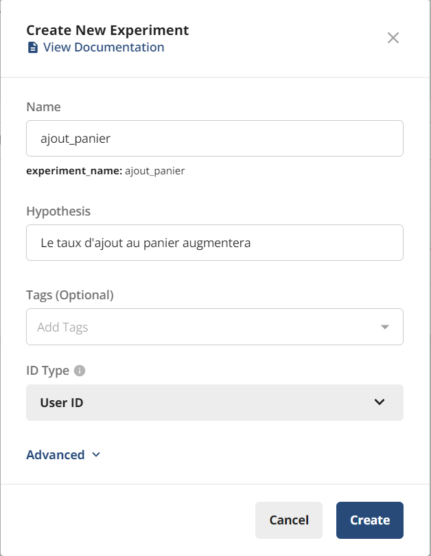
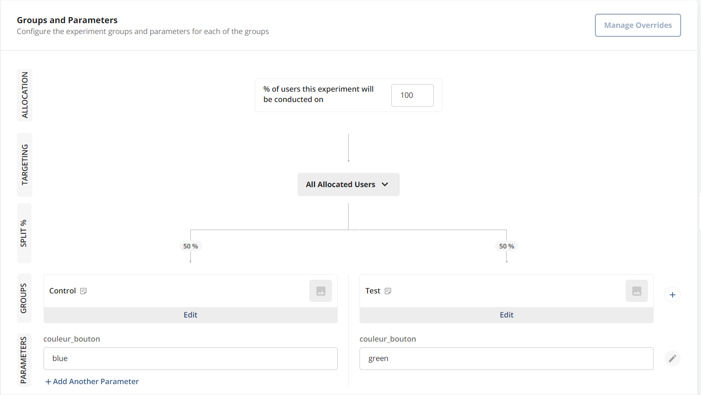
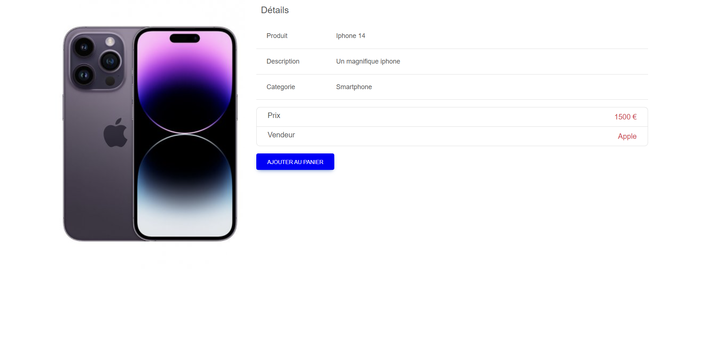
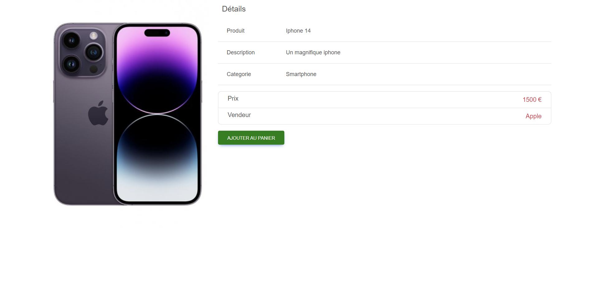

# Test A/B
Pour cette partie, nous utiliserons notre simulateur de site marchand.

Le but sera de tester deux variantes de notre site, une avec un bouton d'ajout au panier bleu et une autre avec un bouton vert.

Pour cela nous utiliserons statsig, un service offrant un panel d'outils de visualisation d'expérience sur notre solution en temps réel.

## Création d'une expérience
1. Créer un compte sur [statsig](https://statsig.com/)
2. Aller sur la [console](console.statsig.com) et créer un nouveau projet.
3. Créer une nouvelle expérience avec le nom de votre choix, pour ce tutoriel, nous utiliserons le nom `ajout_panier`.

4. Plus loin dans la page, nous pouvons ajouter des paramètres du test A/B. 
Pour ce tutoriel, nous utiliserons le paramètre `couleur_bouton` avec les valeurs `blue` et `green`.

A savoir, vous pouvez indiquez quelle part de la population verra le test. Dans notre cas, nous laisserons la valeur par défaut à 50%.
5. Une fois l'expérience créée, nous pouvons la lancer et commencer les configurations côté front.
6. Pour notre application de test sous Angular, nous utiliserons la librairie [statsig-js](https://www.npmjs.com/package/statsig-js).
```bash
npm install statsig-js
```
7. Puis ajouter le code suivant là où vous souhaitez lancer l'expérience.
```typescript
import Statsig from "statsig-js";
await Statsig.initialize(
  "<votre clé d'API client>", // Récupérable ici https://console.statsig.com/4mJ8LKvbS3iR1cholOdw1J/api_keys
  { userID: "<un identifiant utilisateur>" },
);
const expConfig = Statsig.getExperiment("ajout_panier"); // Récupère la configuration de l'expérience ajout_panier
this.buttonColor = expConfig.get("couleur_bouton", "blue"); // Récupère la valeur du paramètre couleur_bouton
console.log("buttonColor", this.buttonColor); // Affiche la couleur du bouton
```
Pour notre application, nous utiliserons la variable `buttonColor` dans le css.
8. Voilà le résultat !


9. Vous pouvez ensuite utiliser la fonction `logEvent` pour enregistrer des événements et les visualiser dans la console.
```typescript
  Statsig.logEvent("<votre evenement>", "<un identifiant de produit>", "<un objet>");
```
