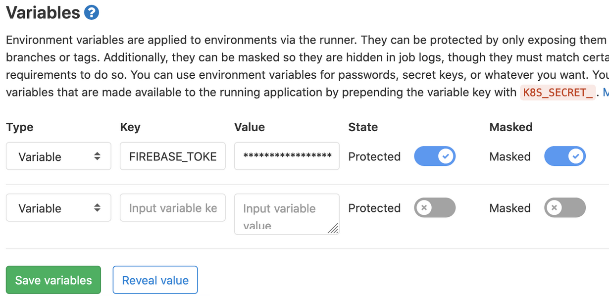

# Canary release
Pour cette partie, nous continuerons d'utiliser le même site marchand que la partie A/B Testing.

Le but sera ici d'avoir 2 versions de notre site, une version stable et une version de développement.

La version de développement (qu'on peut appeler canary, ou staging) sera accessible depuis un autre domaine.

Pour cela nous utiliserons les services cloud Firebase, plus particulièrement Firebase Hosting.

Firebase est un ensemble d'outils cloud proposant des services de base pour développer des applications.

## Initialisation
1. Créer un compte sur [Firebase](https://firebase.google.com/)
2. Installer le CLI de Firebase
```bash
npm install -g firebase-tools
```
3. Se connecter à Firebase
```bash
firebase login
```
## Création d'un projet de production
1. Créer un nouveau projet
```bash
firebase init
```
2. Sélectionner Hosting
3. Choisir un nom de projet et la configuration souhaité

Faire la même chose pour le projet de staging.

## Configuration des targets pour le déploiement
Ces targets permettent de déployer sur les différents environnements.
1. Ajouter la 1ere target de production
```bash
firebase target:apply hosting prod <nom du projet>
```
2. Ajouter la 2eme target de staging
```bash
firebase target:apply hosting staging <nom du projet>
```

## Deploiement
Pour le déploiement automatique, nous utiliserons Gitlab CI.
1. Récupérer le token de déploiement
```bash
firebase login:ci
```
2. Ajouter le token dans les variables d'environnement de Gitlab CI
   (Settings > CI/CD > Variables)
  
3. Ajouter le fichier [.gitlab-ci.yml](../gitlab-ci.yml) à la racine du projet

4. Ce template permet de build et déployer automatiquement en staging et en production à chaque push sur la branche master et develop.
