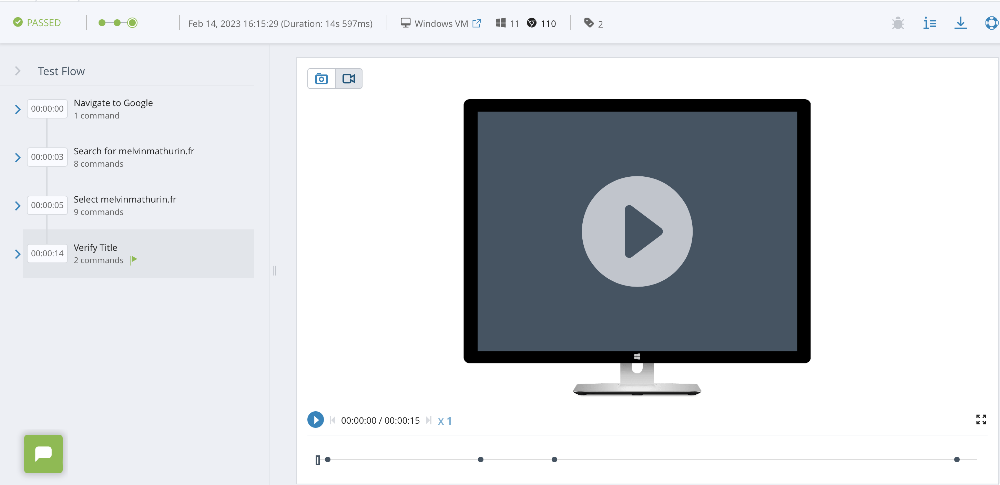
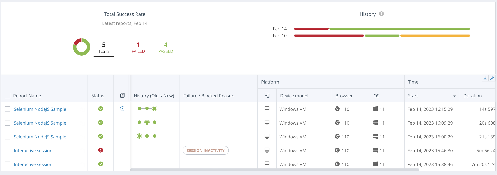

# Perfecto
## Principe de perfecto
Perfecto Mobile est une entreprise qui propose des solutions d'automatisation de tests pour les applications mobiles et web. Leurs outils permettent aux développeurs de tester et de déboguer leurs applications sur une large gamme de dispositifs et de plateformes, y compris les smartphones, les tablettes, les ordinateurs de bureau et les navigateurs Web. Perfecto Mobile offre également des fonctionnalités de test en continu, d'analyse de données et de collaboration pour aider les équipes de développement à accélérer leur processus de développement et à améliorer la qualité de leurs applications.

## Manual Testing
Le test manuel de Perfecto Mobile est une approche où les testeurs effectuent des tests manuellement sur des dispositifs physiques ou des simulateurs pour vérifier le fonctionnement et l'expérience utilisateur de l'application. Avec les outils de Perfecto Mobile, les testeurs peuvent reproduire les scénarios d'utilisation réels et identifier les bugs et les problèmes d'expérience utilisateur en temps réel. Les résultats de ces tests sont documentés et communiqués aux équipes de développement pour une résolution rapide des problèmes.

### Mise en place
Pour ce qui est des tests manuels nous avons suivi ce tutoriel :
[Tuto](https://help.perfecto.io/perfecto-get-started/content/perfecto/get-started/get_started_with_manual_testing.htm)

Nous avons simplement simulé une VM, été sur un site que nous voulions testé et manuelement nous avons validé ou non le test.

Voici un exemple de d'analyse report pour un manual testing :

## Automation Testing
Le test automatisé de Perfecto Mobile est une approche où les tests sont exécutés par des outils d'automatisation à l'aide de scripts préenregistrés. Avec l'automatisation des tests, les équipes de développement peuvent exécuter des tests plus rapidement et plus fréquemment pour garantir la qualité et la stabilité de leur application. Les tests automatisés de Perfecto Mobile peuvent être exécutés sur une large gamme de dispositifs et de plateformes pour garantir une couverture maximale des tests. Les résultats des tests automatisés sont également documentés et communiqués aux équipes de développement pour une résolution rapide des problèmes.

Pour ce qui est du script de test, nous n'avons accès qu'à cette gamme de test, si nous prenions la version payante, nous aurions pu avoir accès à plus de tests. Il est également possible d'écrire nos propres tests.

Voici un exemple de d'analyse report pour un automation testing :

### Mise en place
Pour ce qui est des tests automatiques nous avons suivi ce tutoriel :
[Tuto](https://help.perfecto.io/perfecto-get-started/content/perfecto/get-started/get_started_with_automation_testing.htm)

Nous avons générer les scripts de tests en Javascript. Lancé la commande qui execute le script  et nous n'avons plus qu'a consulté le report effectué.

## Rapport de test

Perfecto génère dans les 2 cas les reports d'analyse. Le testeur possède un espace qui répertorie tous les tests effectués. Voilà à quoi il ressemble :

## Problèmes rencontrés
Un premier problème est que la version gratuite de perfecto n'est disponible que sous un essai de 14 jours (bien que l'on peut créer un autre compte avec uniquement un email). 

Un second problème rencontré pendant le tuto est que, s'il l'on suit le tuto sur ce lien : 
https://help.perfecto.io/perfecto-get-started/content/perfecto/get-started/home-get-started.htm
Il n'est pas indiqué ce qu'il faut rentrer comme "cloud name" quand on est en essai gratuit. Il faut rentrer le mot "trial".

## Conclusion 
Perfecto peut aider à mettre en place du continuous integration en permettant l'automatisation des tests sur différents environnements d'exécution, en offrant un ensemble complet de fonctionnalités pour la gestion de tests et la génération de rapports de résultats. Perfecto peut également aider à la mise en place d'une intégration continue en fournissant des fonctionnalités de suivi de défauts et de génération de rapports. Les rapports de test détaillés générés par Perfecto permettent de suivre l'évolution des résultats des tests au fil du temps et de détecter rapidement les problèmes de qualité. 