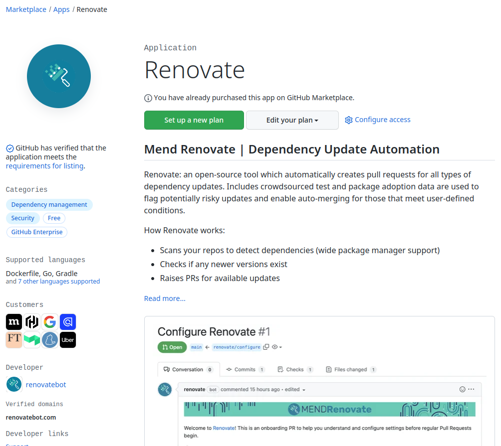
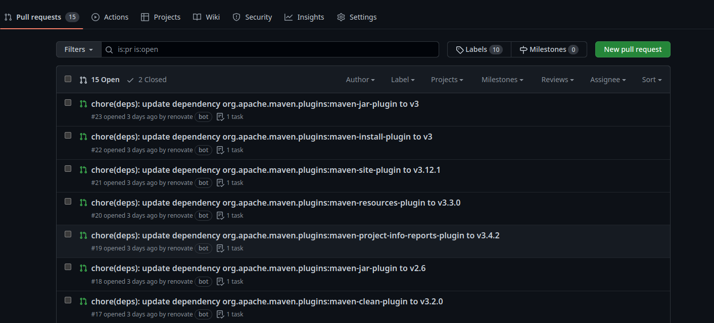

    

<h1 align="center">RenovateBot</h1>

---

## Description

RenovateBot is used to update the dependencies of a project. It creates pull requests to allow you to validate the updates.  
With this app, all your dependencies are up to date and the security and stability of the system are improved. It is a direct alternative to Dependabot, but it is more versatile and more widely used.

## Installation

Add the RenovateBot app from the GitHub marketplace. You can set the app on the entire organization, meaning that every repository will have this functionality

## Usage

When pull requests appeared, you just have to validate the update if you want to.
