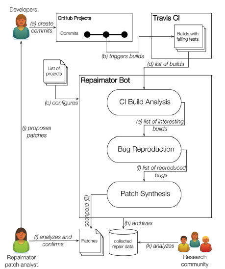
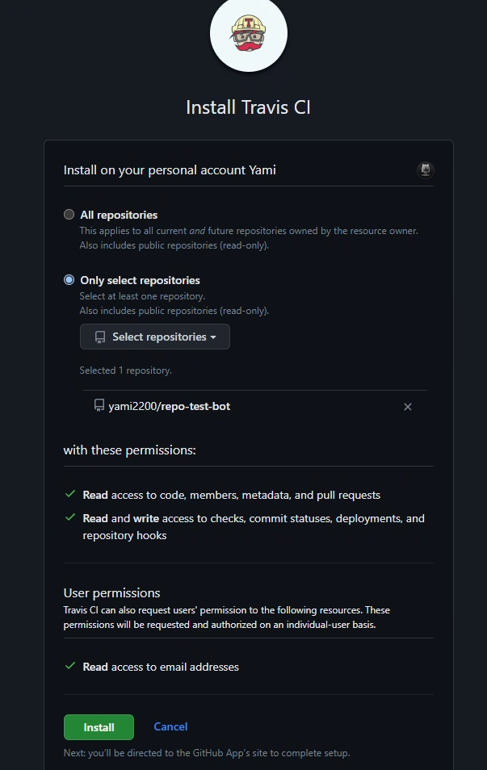
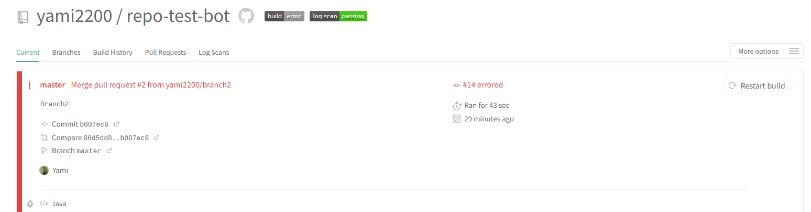

<p align="center">
    
</p>

<h1 align="center">Repairnator</h1>

---

## 🤨 What is Repairnator?

Repairnator is an open source tool for automatically repairing failing builds. It consists of 3 steps :
- Detect a failure, static warning in a build
- Look for a specific patch to fix the failure
- Apply the patch (if found) with a pull request



More detailed on the following paper : [Repairnator patches programs automatically](https://ubiquity.acm.org/article.cfm?id=3349589)

## 🧱 How to setup with a Github App

- First create a java maven project repository on Github 
- Go on the following link : https://github.com/apps/repairnator-bot

- Configure the app for the specific repository you want to use it on
- Repairnator requires Travis CI builds.
- Install Travis CI on the repository from this link : https://github.com/marketplace/travis-ci



- Create a .travis.yml file in the repo, see documentation on how to configure Travis : [Travis Tutorial](https://docs.travis-ci.com/user/tutorial/)
- For this tutorial, you can write in your .travis.yml file :

```yml
language: java
notifications:
  email:
    on_failure: never
    on_success: never
```

- Commit and push the .travis.yml file
- Create a pull request with a failing build for your repository.
- On the [Travis panel](https://app.travis-ci.com/) you should see something like this :



- If a patch is found by Repairnator, a pull request will be created with the proposed patch (from docs : approx 1/1000 builds).
