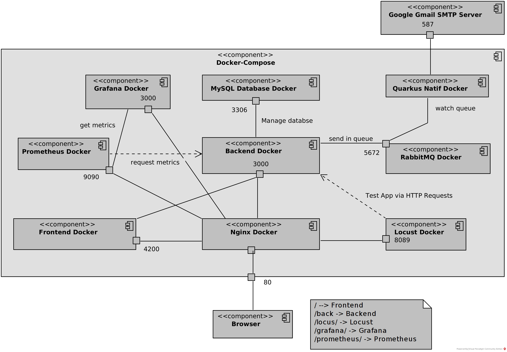

# Software Architecture Project

**Kilian Cornec** - **Thomas Delapart**

# 1 - Using the application

In this project, we will add microservices to the application of the WEB course through Docker. Docker allows us to deploy easily the application and combine a lot of containers together. The main goal of this project is to understand how to use Docker and how to deploy a microservices application. The functionalities we want to add are : Mailer, AMQP Tool, Monitoring, Testing Tool.

### To start the application :

- Clone the project
- Use command : ```docker-compose up -d```

### Stop it :

- Use command : ```docker-compose down```

**All the docker images are available on DockerHub so no needs to build the project**
The images are public, so you can use them without any problem under the account : [Kiki2956](https://hub.docker.com/u/kiki2956)

### Once the application started, there is three main functionalities :

- 1 - Web Application : [localhost/](localhost/)
- 2 - Test Interface via Locust : [localhost/locus/](localhost/locus/)

- 3 - Monitoring via Grafana & Prometheus : [localhost/grafana/](localhost/grafana/) & [localhost/prometheus/](localhost/prometheus/)

## 1.1 - Web Application :

This is an application for managing users and associations. There are the possibilities to :

- Register
- Manage your account
- Display users, create new ones and delete them
- Display associations, create new ones and delete them

An email address is asked to create your account and an email will be sent when the account is created, modified and deleted.

## 1.2 - Test Interface via Locust

Locust is available to test the application. Locust is a python framework to test HTTP server by sending every *x* seconds HTTP requests.

For the moment, there is only one test available. The test of the default endpoint of the backend [http://back:3000/](http://back:3000/). But a lot of others tests can be added.

> On Locus/Data you can find the python file where there is the endpoint test.

## 1.3 - Monitoring via Grafana & Prometheus

1. Prometheus allows you to get metrics from others application to see if they still run fine. For the moment only the backend is configured to send its metrics, but it is possible to configure the others services to do the same.

> On Prometheus you can find the configuration file of Prometheus, in this one you can find the get of the metrics of the backend.

2. Grafana's goal is (here) to display the metrics got by Prometheus in a nice dashboard. For now the service is available but nothing it is configured (needs to mount volumes).

> Grafana configuration file is available in Grafana folder.

# 2 - Architecture



Now let's talk about the architecture of the application. First of all, this is a micro-services application. All the services are containers, and they communicate together with the networks define on the docker-compose.

The different components of the application are were given in the subject. So we understood why we have to use them, but there were no really choices to make. We had to use them.

## 2.1 - Backend : NestJS

The backend is a typescript NestJS application which has been dockerised. We used npm as the package manager of the application.

**Why NestJS ?** NestJS is a very popular backend development tool in typescript which works fine to communicate with a database (ORM) and setting up a REST API. 

## 2.2 - Frontend : Angular

The frontend is an Angular application which has been dockerised. Material Design is used in the front to build easily the interface.

**Why Angular ?** This is one of the most (the most) complete framework to create fronted application. We have chosen it because it is very popular and will help us understand other frameworks frontend like React or Vue.

## 2.3 - Database : MySQL

The container MySQL is the database of the backend to store data. We had to pick a SQL component because TypeORM is a ORM for SQL database. A volume is mounted to not lose the data after the application is stopped and the container is deleted.

**Why MySQL ?** MySQL is the default choice to setting up a database quickly. But, may SGBD like Postgre SQL could work as fine. MySQL has the advantage to be the most popular SGBD, so the most documented as well.

## 2.4 - Mailer : Quarkus

We needed to setting up a way to send email to users. Quarkus is a Java framework which is very quick to deploy and to use. We used Google to send the emails.
> The emails are send by the email address : "kikilemarchantdesable@gmail.com"

**Why Quarkus ?** Quarkus was a good solution because it is very quick to deploy. Also, despite is a java based framework, it is possible to compiled it natively to gain performance during execution.

## 2.5 - AMQP Tool : RabbitMQ

To communication the information from the back to Quarkus, we set up a queue. This queue help us to order and keep waiting the messages sent by the backend, waiting for Quarkus to get them and send an email.

**Why RabbitMQ ?** As previously, it is a popular and well documented tool. A lot of frameworks / languages are available. Quarkus is one of them. With docker, we could deploy it very quickly.

## 2.6 - Nginx

There is only one entry of the application, it is the port 80. This is a good practice to use only one port for the application, reducing that way the complexity of the application for the user and his vulnerability.

How it is working ? Basically we used Nginx to create a reserve proxy which rout all the requests in the right destinations :

- Web Application : [localhost/](localhost/)
- Test Interface via Locust : [localhost/locus/](localhost/locus/)
- Motiring via Grafana & Prometheus : [localhost/grafana/](localhost/grafana) & [localhost/prometheus/](localhost/prometheus/)

> You can see Ngninx/nginx.conf to have more details on this.

**Why Nginx ?** Nginx is a well known tool, with a lot of documentations on internet, it is easy to use, and it is easy to display on a container. Ngix had almost no alternatives.

## 2.7 - Testing Tool : Locust

It is obviously important to be able to test an application quickly and exhaustively. That why, we have chosen Locust : an HTTP Python testing tool. With it, we can test all the endpoints of the backend and of the frontend.

**Why Locust ?** We picked it because it is very completed, for example it is possible to test endpoints which need a authentication  token pretty easily. Also, it is in Python, easy and quick to use, in Python and with a nice web interface.

## 2.8 - Monitoring Tool : Prometheus & Grafana

Prometheus is a tool which allows us getting metrics from other services. That way, we can monitor the application and see if everything is running fine. It is very useful to monitor the application.

Grafana is a tool which allows to display the metrics in a nice dashboard. Here, Grafana is perfectly working and linked to Prometheus but there is no grafana configuration yet, that is why you can't see any dashboard.

(We installed a package npm on the backend, nestJS for getting metrics)

(The password and login are admin/admin)

**Why Prometheus & Grafana ?** Prometheus and Grafana are very popular tool to monitor a web app. All the micro-services can be easely configured to send their metrics to Prometheus.

# 3 - Configuration

## 3.1 - MySQL

- port : `3306`
- login : `root`
- password : `admin`
- database name : `test`

## 3.2 - RabbitMQ

- port : `5673`
- login : `mailuser`
- password : `mailpassword`
- queue name : `mailqueue`

# 4 - Service status

| Service    |               status                |
| :--------- | :---------------------------------: |
| Backend    | implemented, Monitored, Load tested |
| Frontend   |             implemented             |
| MySQL      |             implemented             |
| RabbitMQ   |             implemented             |
| Quarkus    |             implemented             |
| Locust     |               design                |
| Prometheus |              proposed               |
| Grafana    |              proposed               |

# 5. Feedbacks

We really enjoyed this project, it was for us the occasion of discovering new useful tools and technologies. We will use them in the future for sure. We had fun doing this project and we learned a lot of things. But this project was very too long and often it was hard to figure out by ourselves.

We recommend reducing the size of project, give it more labs sessions, give more time to do it and give more help and support to the students.
We